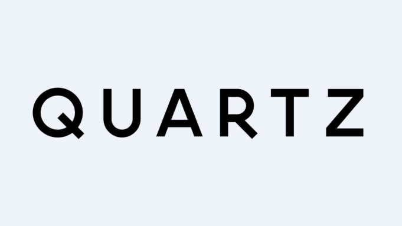

# Quartz Case Study

##Overview/ Origins
- Quartz is Bank of America Merrill Lynch's integrated trading, position management, pricing and risk management platform. 
- Quartz is strictly used by employees of Bank of America to access and manipulate a vast amount of financial data related to the companies operations.
- 
- 
## Why this helps
-
- The kind of firm-wide risk management calculations required by regulators are extremely painful to do without something like Quartz. For example, regulators require quarterly backtests involving the entire B​ank-wide portfolio of financial derivatives (options, etc.). Before Quartz, the backtesting team was hard pressed to complete the tests in the three months between reporting periods. With Quartz, the tests took only a few days, and most of that time was waiting for the calculations to finish.

